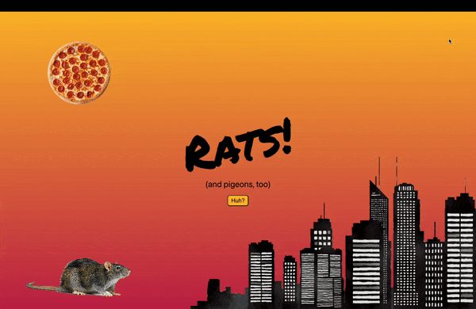
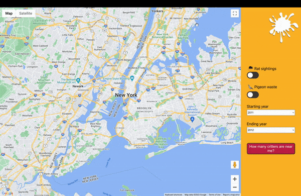
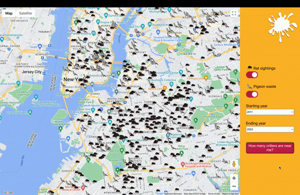

# About *Rats!*

*Rats!* is an interactive web app that displays rat sightings and reports of pigeon waste across New York City. This React-Redux app was the winner of my bootcamp class’s Stackathon for its memorable concept and creative take on data visualization.

Using the Google Maps API as a canvas, I displayed the locations of rat sightings and instances of pigeon waste based on data I pulled from the NYC Open Data API. Users can filter this data by type of report or by year. They can also see how many reports were made in a given location by dragging a circle around the map.

Deployed site: https://ratsnyc.herokuapp.com/
 Video walkthrough: https://youtu.be/Q58oBMyDLOM

# Features

The home page of the app features a rat darting behind a building, courtesy of CSS transitions. Upon clicking a button, users gain some background information about the data that they are about to see.

Those with slower connections will see a spinning pizza wheel as the app loads up.

The app’s main page is a map of New York City with different icons for rat sightings and reports of pigeon waste. Users can filter the data using the toggle buttons and drop down menus.

Clicking “How many critters are near me?” allows users to see how many reports occurred within a 1-mile radius of a given location by dragging a circle around the map.

# Tech Stack
* React
* Redux
* NYC Open Data API
* Google Maps API
